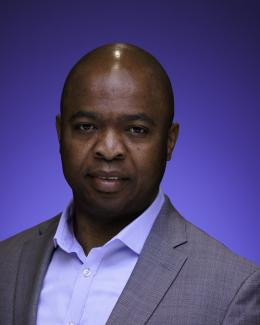

  
 

---------------------------------------
 
  
#### Title: The Role of AI and Earth Observation in Safeguarding Society and Economic Stability

#### Speaker: Dr. Dalton Lunga    

#### Abstract:    
Accurate prediction of extreme weather, climate events, and monitoring of man-made hazards, is crucial for safeguarding society and protecting economic stability. Artificial intelligence and Earth observation are emerging as transformational technologies enabling timely preparedness, mitigation, response, and recovery strategies. This discussion will share example impacts as the frequency, intensity, and durations of armed conflicts and natural disasters—wars, flooding, tornadoes, hurricanes—are increasing under a changing climate and geopolitical instabilities, bringing unprecedented destruction to property and lives. I will talk about the growing need to develop capable Earth observation-based foundation models. Touching on the current challenges, gaps, and how Oak Ridge National Laboratory is leading the charge in establishing best practices in scaling and training foundation models. I will discuss downstream impacts due to ORNL’s OReOle and ORBIT which are Earth and Climate foundation models, respectively.

#### Speaker Bio: 
<a href="https://www.ornl.gov/staff-profile/dalton-d-lunga">Dalton</a> is a group leader for GeoAI and a senior R&D staff scientist at ORNL and a recent Alumni of the National Academy of Engineering Granger’s Foundation Program.  He is an Associate Editor for Geoscience and Remote Sensing Letters. Dalton is an interdisciplinary scientist with expertise in artificial intelligence, computer vision, high-performance computing, and remote sensing. He leads multidisciplinary teams and projects focused on developing novel methods at the intersection of AI, computer vision, and geography toward the built and physical environment mapping using earth observation data. His research is impacting the development of accurate population estimates, informing disaster response, identifying at-risk areas to support national security operations missions. Prior to ORNL, Dalton was a Team Lead and Senior Research Scientist at the Council for Scientific and Industrial Research, South Africa where he established and led a Data Science for Decision Impact team. He received his Ph.D. in Electrical and Computer Engineering from Purdue University, West Lafayette.

-----------------------------------------------

#### Title: TBD

#### Speaker: Dr. B. Aditya Prakash

#### Abstract:
TBD

#### Speaker Bio:
<a href="https://faculty.cc.gatech.edu/~badityap/">B. Aditya Prakash</a> is an Associate Professor in the College of Computing at the Georgia Institute of Technology (“Georgia Tech”). He received a Ph.D. from the Computer Science Department at Carnegie Mellon University in 2012, and a B.Tech (in CS) from the Indian Institute of Technology (IIT) -- Bombay in 2007. He has published one book, more than 95 papers in major venues, holds two U.S. patents and has given several tutorials at leading conferences. His work has also received multiple best-of-conference, best paper and travel awards. His research interests include Data Science, Machine Learning and AI, with emphasis on big-data problems in large real-world networks and time-series, with applications to computational epidemiology/public health, urban computing, security and the Web. Tools developed by his group have been in use in many places including ORNL and Walmart. He has received several awards such as Facebook Faculty Awards (2015 and 2021), the NSF CAREER award and was named as one of ‘AI Ten to Watch’ by IEEE. His work has also won awards in multiple data science challenges (e.g the Catalyst COVID19 Symptom Challenge) and been highlighted by several media outlets/popular press like FiveThirtyEight.com. He is also a member of the infectious diseases modeling MIDAS network and core-faculty at the Center for Machine Learning (ML@GT) and the Institute for Data Engineering and Science (IDEaS) at Georgia Tech. Aditya’s Twitter handle is @badityap. 

