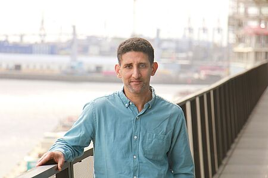

  
 

---------------------------------------
 
  
#### Title: Digital Twins for Smart Cities

#### Speaker: Dr. Youness Dehbi    

#### Abstract:    
In the era of smart cities, 3D semantic city models are a hot topic. The automatic acquisition of such models is usually facing two challenges: coping with huge and noisy data and dealing with sparse 
observations. The first obstacle needs strong models to reflect the variety and cope with the complexity of cities. To overcome the second barrier, probabilistic reasoning supported by strong prior knowledge is a 
key issue to generate reliable and accurate models. On the one hand, we present advanced and cutting-edge machine learning methods allowing for both relational structure description and sound statistical inference. This enables an automatic derivation of a wide range of rules for the reconstruction and interpretation of outside building models. On the other hand, these interpreted models represent a bridge to derive corresponding indoor models based on probabilistic reasoning from sparse noisy data subsequently. The semantically rich acquired models pave the way for smart city applications as digital twins of their real-world counterparts.

#### Speaker Bio: 
Dr. Youness Dehbi is a full professor and head of the Computational Methods Lab at the HafenCity University Hamburg, Germany. He studied computer science and communication research at the University of 
Bonn,  Germany.  After  graduating  in  2008,  he  started  his  academic career  as  a  research  assistant  in  the Geoinformation group at the Institute of Geodesy and Geoinformation at the same university. He finished his PhD thesis entitled “Statistical relational learning of semantic models and grammar rules for 3D building reconstruction from 3D point clouds” in the same working group, where he was responsible for the Urban Reasoning & Analytics field as Senior Researcher after his PhD. In his research, he is interested in both the efficient semantic interpretation of urban environments from dense observations and the probabilistic estimation of 3D city models from sparse noisy data. Youness Dehbi published a range of 
scientific contributions including awarded papers, he is acting as a reviewer for several research journals and is a member of various scientific committees. Since 2022, he is advisor of the International Society of Photogrammetry and Remote Sensing working group IV/9 (ISPRS WG IV/9) "Spatially Enabled Urban and Regional Digital Twins". 

