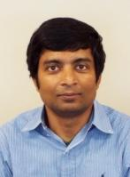

  
 

---------------------------------------
 
  
#### Title: Data-Driven Time Series Forecasting for Social Studies Using Scalable Spatio-Temporal Graph Neural Networks

#### Speaker: Dr. Latifur Khan    

#### Abstract:    
Time series forecasting with additional spatial information has attracted a tremendous amount of attention in recent research, due to its importance in various real-world applications on social studies, such as conflict prediction and pandemic forecasting. Conventional machine learning methods either consider temporal dependencies only, or treat spatial and temporal relations as two separate autoregressive models, namely, space-time autoregressive models. Such methods suffer when it comes to long-term forecasting or predictions for large-scale areas, due to the high nonlinearity and complexity of spatio-temporal data. In this talk, we propose to address these challenges using spatio-temporal graph neural networks. 
Most existing spatiotemporal Graph Neural Network (GNN) frameworks are based on a two-step modeling process, which means that spatial and temporal dependencies are modeled in separate steps. Targeting the shortcomings of existing studies,  we propose a unified spatio-temporal GNN framework that captures both spatial and temporal dependencies in a single step. Specifically, for each node in the graph, a unified neural network component is designed to simultaneously extract information from its surrounding neighbors and its past records, which enables less information loss with fewer model parameters.
Empirical results on Violence Early Warning System (ViEWS) dataset and U.S. Covid-19 dataset indicate that our method significantly improved performance over the baseline approaches. To  improve predictive performance over the ViEWS benchmark, we utilize political event coding, Conflict and Mediation Event Observations (CAMEO)-coded event data. For this, we propose deep-learning based frameworks to obtain state-of-the-art results for extracting structured events from natural language text in political and social sciences domains.

*This work is funded by NSF, and NSA. The work is in collaboration with Dr. Patrick Brandt and Dr. Jennifer Holmes, School of Economic, Political and Policy Sciences, UT Dallas. 

#### Speaker Bio: 
Dr. Latifur Khan is currently a full Professor (tenured) in the Computer Science department at the University of Texas at Dallas, USA where he has been teaching and conducting research since September 2000. He received his Ph.D. degree in Computer Science from the University of Southern California (USC) in August of 2000.  
Dr. Khan is a fellow of IEEE, IET, BCS, and an ACM Distinguished Scientist. He has received prestigious awards including the IEEE Technical Achievement Award for Intelligence and Security Informatics, IEEE Big Data Security Award and IBM Faculty Award (research) 2016. Dr. Latifur Khan has published over 300 papers in premier journals and prestigious conferences. 
Currently, Dr. Khan’s research area focuses on big data management and analytics, data mining and its application over cyber security, complex data management including geo-spatial data and multimedia data. His research has been supported by grants from NSF, NIH, the Air Force Office of Scientific Research (AFOSR), DOE, NSA, IBM and HPE.  More details can be found at: www.utdallas.edu/~lkhan

---------------------------------------
 
 
#### Title: Unsupervised Representation Learning for Remote Sensing Big Data

#### Speaker: Dr. Ranga Raju Vatsavai    

#### Abstract:    
Remote sensing data is a prime example of spatial big data. NASA recently collected its 10 millionth Landsat image. Coarse-resolution (30 m) Landsat collection itself tops a petabyte, whereas private satellite data producer, Maxar holds more than 125 petabytes of high-resolution multi-spectral imagery. Compared to traditional machine learning approaches designed for coarse resolution, high-resolution images require a bigger spatial context than a pixel to understand the image content. Recent advances in deep learning proved that high-resolution images can be accurately analyzed using image tiles (patches), however, these new methods require both large ground-truth data and computing power. In this presentation, we posit unsupervised representation learning as a framework for analyzing high-resolution remote sensing data. We show their efficacy in reducing the ground truth data as well as computational requirements for analyzing large-scale remote sensing data.
#### Speaker Bio: 
Dr. Raju Vatsavai is a Chancellor’s Faculty Excellence Program Cluster (CFEP) Professor in Geospatial Analytics in the Department of Computer Science, North Carolina State University (NCSU). He works at the intersection of spatial and temporal big data management, analytics, and high performance computing with applications in the national security, geospatial intelligence, natural resources, climate change, location-based services, and human terrain mapping (STAC-Lab @ CSC.NCSU). As the Associate Director of the Center for Geospatial Analytics (CGA), Raju plays a leadership role in the center’s strategic vision for spatial computing research. Before joining NCSU, Raju was the Lead Data Scientist for the Computational Sciences and Engineering Division (CSED) at the Oak Ridge National Laboratory (ORNL). Raju has more than 25 years of research and development experience in large-scale spatiotemporal data management and geographic knowledge discovery. He worked at many leading research laboratories: ORNL (2006-2014), IBM-Research (IRL, IIT-Delhi Campus, 2004-2006), University of Minnesota (Remote Sensing Laboratory, St. Paul, USA. 1999-2004), AT&T Labs (R&D HQ, Middletown, NJ. USA. 1998), and the Center for Development of Advanced Computing (CDAC, Pune University Campus, India. 1995-1998). He has published more than 100 peer-reviewed articles in leading conferences and journals, and edited two books on “Knowledge Discovery from Sensor Data.” He served on program committees of leading international conference including ACM KDD, AAAI, ACM GIS, ECML/PKDD, ICDM, SDM, CIKM, IEEE BigData, WACV and co-chaired several workshops including ICDM/SSTDM, ICDM/KDCloud, ACM SIGSPATIAL BigSpatial, Supercomputing/BDAC, KDD/LDMTA, KDD/Sensor-KDD, and SDM/ACS. He holds MS and PhD degrees in computer science from the University of Minnesota.

---------------------------------------

